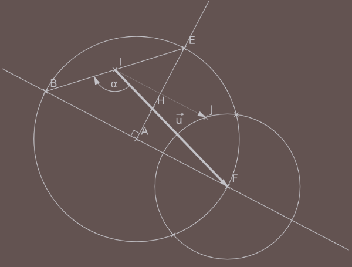

# purescript-canvas-geometry

A library to build planar geometric drawings on the canvas from

* points, lines, half-lines, segments and circles,
* using intersections to define new points 

The main thing to say is that vectors are not drawable (but
used everywhere nonetheless) and in order to see an arrow on 
the screen, arrow tips should be added to segments.

## An example

The code: 

```purescript
module Main where

import Prelude
import Effect (Effect)
import Data.Maybe(Maybe(..))
import Partial.Unsafe(unsafePartial)
import Graphics.Canvas (CanvasElement, getCanvasElementById, getContext2D)
import Graphics.Drawing(render)
import Color (rgb)
import Graphics.Canvas.Geometry (class DrawableSet, arc, circle, drawIn
                         , halfline, length, line, meets, middle
                         , normalTo, point, rename, rightangle
                         , segment, vector)

foreign import setAttribute :: 
  String -> String -> CanvasElement -> Effect Unit

foreign import setBodyBackground :: String -> Effect Unit

main :: Effect Unit
main = void $ unsafePartial do
  _ <- setBodyBackground "#635351"
  Just canvas <- getCanvasElementById "canvas"
  _ <- setAttribute "width" "800" canvas
  _ <- setAttribute "height" "600" canvas
  context2D <- getContext2D canvas
  
  let ctx = { color: rgb 195 194 199
            , lineWidth: 1.50}
  let draw :: forall a. DrawableSet a => a -> Effect Unit
      draw = render context2D <<< drawIn ctx 
  
  let a = point "A" 310.0 320.0
  let b = point "B" 100.0 210.0
  draw [a, b]
  draw $ line a b
  let c = circle a (length $ vector a b)
  draw c
  let n = normalTo $ vector a b
  let d = halfline a n
  draw d
  let [e] = (rename "E") <$> (d `meets` c)
  draw e
  -- Nothing means no arrow tip:
  let eb = segment e b Nothing
  draw eb 
  let i = middle "I" eb
  draw i
  let [f] = (rename "F") <$> c `meets` (halfline a (vector b a))
  draw f
  render context2D <<< drawIn ctx{lineWidth = 5.0} $ segment i f $ Just "u"
  -- Two boolean parameters to adjust the arrow tip:
  let orientedArc = arc (vector i f) i (vector i b) 50.0 
                        false false $ Just "α"
  draw orientedArc
  let g = circle f (length $ vector i e)
  draw g
  let [h1,h2] = g `meets` c
  draw [h1,h2]
  let [h] = (rename "H") <$> (line a e) `meets` (line i f)
  draw h
  draw $ rightangle (vector a b) a (vector a e) 15.0
  -- The following line is useless but valid:
  let [] = (segment b h Nothing) `meets` (segment e f Nothing)
  let [j] = (rename "J") <$> (halfline b (vector b h)) `meets` 
                              (segment e f Nothing)
  draw j
  -- Draw arrow tip but no vector name:
  render context2D <<< drawIn ctx{lineWidth = 0.5} $ segment i j $ Just ""
  pure unit
```
along with these exports:

```javascript

exports.setAttribute = function (name) {
  return function (value) {
    return function (element) {
      return function () {
        element.setAttribute(name, value);
        return {};
      };
    };
  };
};


exports.setBodyBackground = function (name) {
      return function () {
        document.querySelector("body").setAttribute("style", "background:" + name);
        return {};
  };
};
```

produces:



## Documentation on Pursuit

https://pursuit.purescript.org/packages/purescript-canvas-geometry
